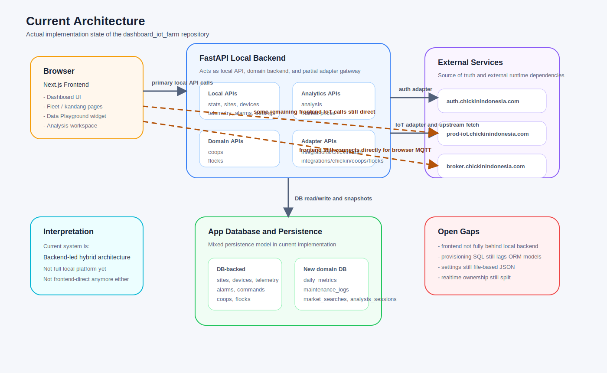
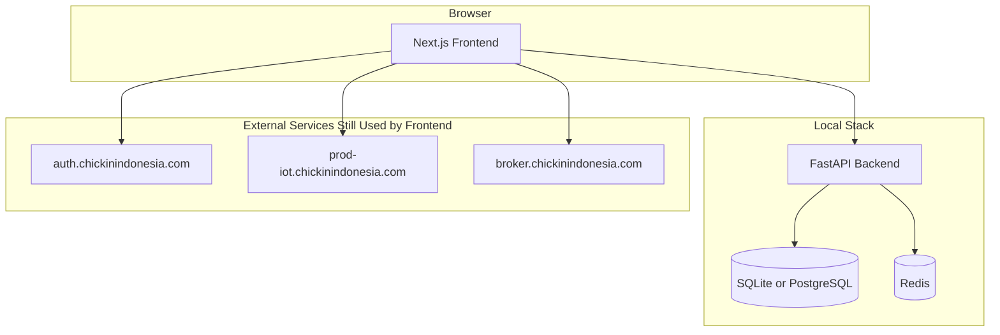

# Dashboard IoT Architecture

Dokumen ini menggambarkan arsitektur yang sedang terpasang di repo, bukan target architecture lama.

## Current Architecture

### Actual Diagram

Diagram di atas adalah gambar arsitektur aktual implementasi saat ini, bukan target plan.

## Split Responsibility

### Local backend

FastAPI di `backend/` saat ini menangani:

- dashboard stats
- site/device CRUD untuk model lokal
- telemetry query dan ingest
- alarms
- settings
- AI analysis
- market price search history
- WebSocket realtime

### External services

Frontend masih langsung memanggil service eksternal untuk:

- login dan logout
- list kandang/flock dari sistem Chickin
- operasi create/delete kandang pada API eksternal
- browser MQTT connection

## Important Consequence

Repo ini belum sepenuhnya "self-contained". Menjalankan `docker compose up -d` hanya menghidupkan DB, Redis, backend, dan frontend lokal. Beberapa flow tetap bergantung pada endpoint eksternal yang di-hardcode di:

- `frontend/lib/auth.ts`
- `frontend/lib/iot-api.ts`
- `frontend/lib/mqtt.ts`

## Local Runtime Flow

1. Frontend memanggil `NEXT_PUBLIC_API_URL` untuk dashboard overview, settings, analysis, dan data lokal.
2. Backend membaca data dari SQLite atau PostgreSQL/TimescaleDB.
3. Backend memakai Redis untuk status realtime dan pub/sub.
4. Backend expose WebSocket di `/ws`.
5. Backend hanya dapat publish/subscribe MQTT jika diarahkan ke broker eksternal via env.

## Gaps vs Older Docs

Dokumen lama masih menyebut beberapa hal yang tidak sesuai implementasi sekarang:

- Express/Vue/Angular as options instead of current Next.js frontend
- InfluxDB as time-series store, padahal backend aktif memakai SQLAlchemy + SQLite/PostgreSQL
- local auth router yang belum ada
- arsitektur backend tunggal penuh, padahal saat ini ada split local plus external
