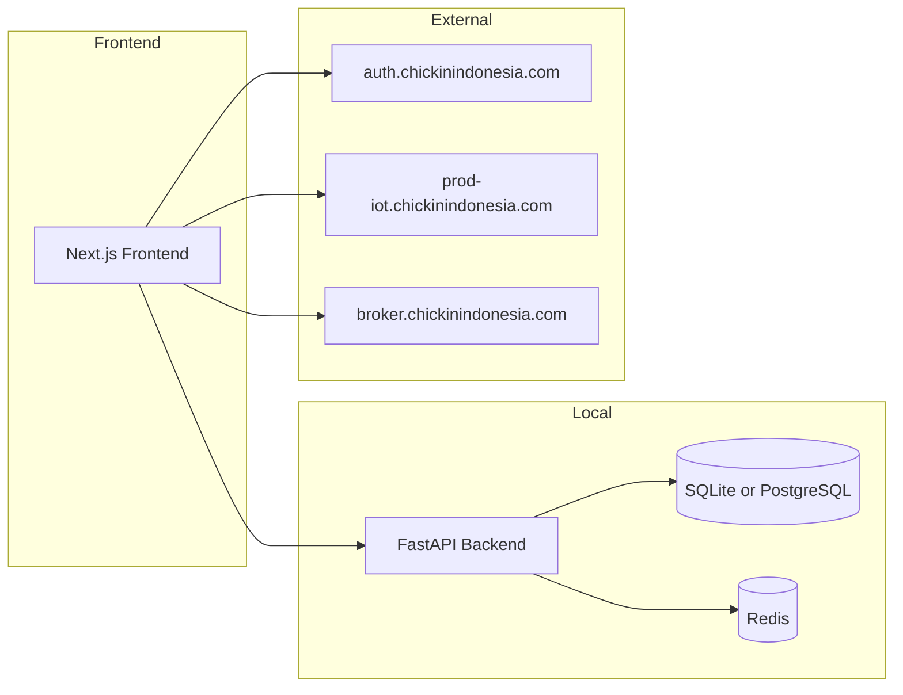
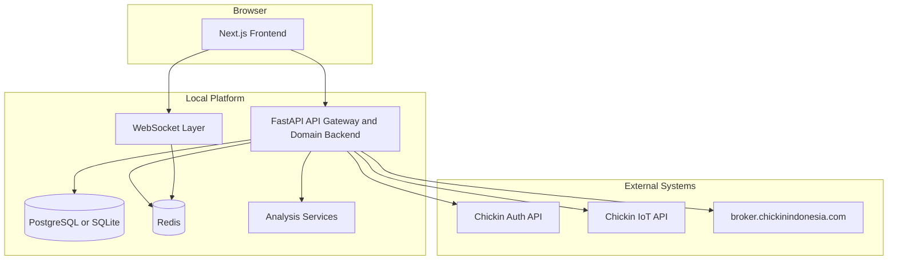
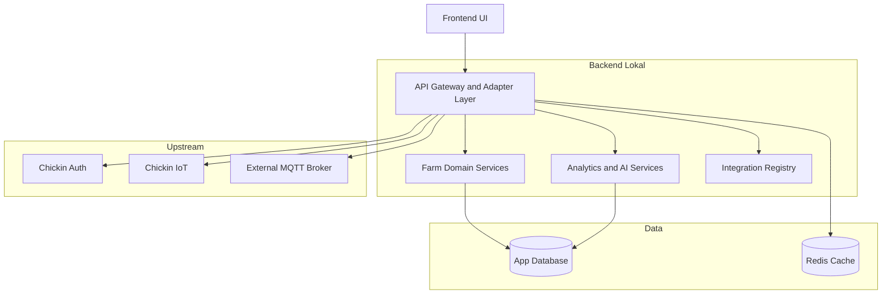
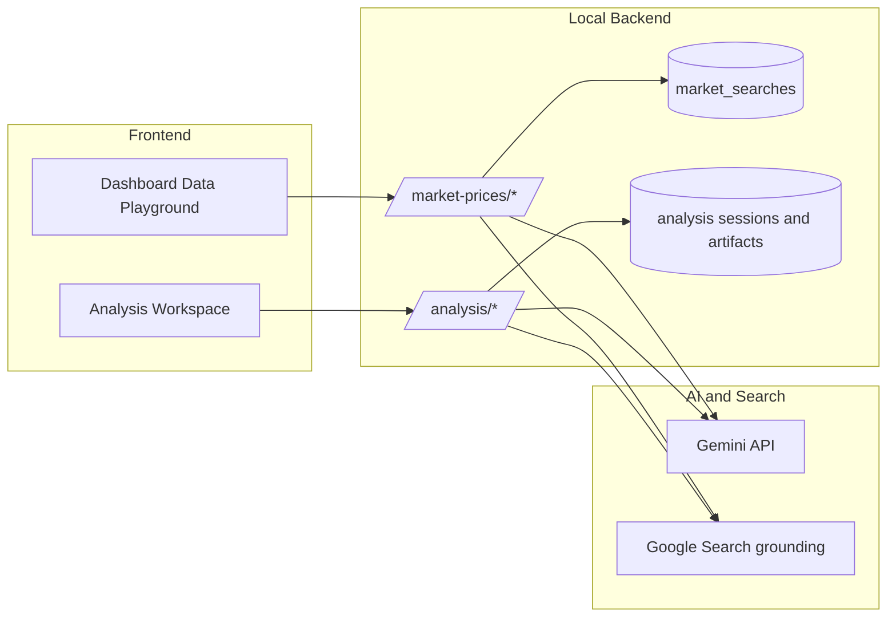
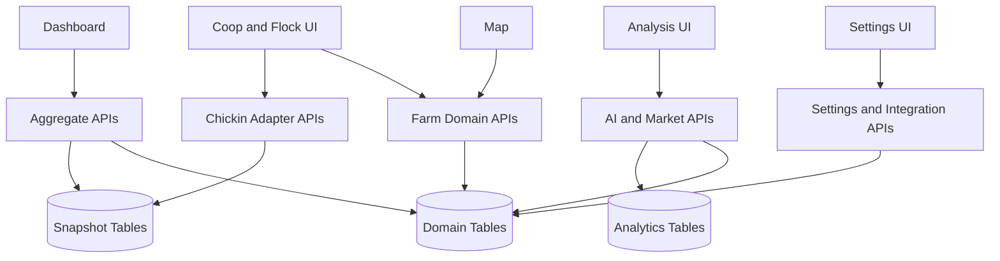
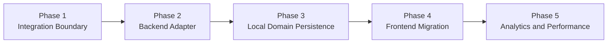
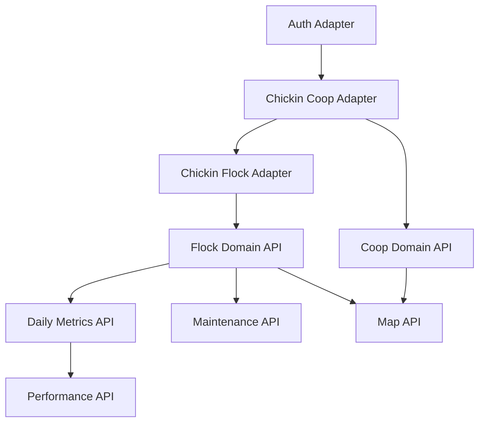
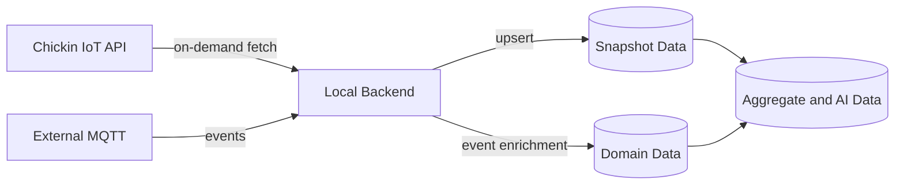

# Architecture Plan

Dokumen ini adalah rencana arsitektur terbaru untuk membawa sistem dari kondisi hybrid saat ini ke arsitektur yang konsisten, maintainable, dan siap dipakai sebagai backend utama frontend.

## 1. Objective

Target arsitektur:

- frontend hanya memanggil backend lokal,
- backend lokal menjadi orchestration layer untuk Chickin external services,
- database lokal menyimpan snapshot, enrichment, analytics, dan domain data yang tidak dimiliki upstream,
- MQTT external tetap dipakai, tetapi konfigurasi dan aksesnya dikelola terpusat.

## 2. Current State

Kondisi saat ini:

- frontend memanggil backend lokal untuk `stats`, `sites`, `devices`, `telemetry`, `alarms`, `analysis`, `settings`, dan `market-prices`,
- frontend masih memanggil langsung endpoint Chickin untuk auth dan kandang/flock,
- ada dua surface playground yang berbeda, yaitu widget market intelligence di dashboard dan workspace analisis penuh di halaman `/analysis`,
- beberapa halaman frontend masih memakai data dummy,
- database lokal masih dominan IoT-generic dan belum penuh mendukung domain farm,
- persistence playground belum seragam: market search history masih file JSON dan memory analisis masih in-memory per process.

Referensi:

- [ARCHITECTURE.md](./ARCHITECTURE.md)
- [CHICKIN_INTEGRATION_DESIGN.md](./CHICKIN_INTEGRATION_DESIGN.md)

### Current State Diagram

## 3. Target Architecture

### Target Responsibility Diagram

### Data Playground Architecture

## 4. Architecture Principles

### Single frontend contract

Frontend tidak boleh mengetahui:

- base URL auth eksternal,
- base URL IoT eksternal,
- shape mentah response upstream,
- credential MQTT selain env/runtime yang sudah distandardisasi.

Frontend hanya tahu:

- `NEXT_PUBLIC_API_URL`
- `NEXT_PUBLIC_WS_URL`
- `NEXT_PUBLIC_MQTT_URL`

### External-first integration, local-first domain

- Chickin tetap menjadi source of truth untuk auth dan sebagian operasional device.
- Domain analytics, maintenance, production metrics, dan enrichment hidup di backend lokal.

### Normalized response model

Backend lokal harus menormalkan payload dari Chickin ke shape internal yang stabil.

### Snapshot plus enrichment

Data yang berasal dari Chickin tidak cukup hanya diteruskan. Ia perlu:

- disimpan sebagai snapshot,
- dihubungkan ke entitas lokal,
- diperkaya dengan metric dan metadata internal.

## 5. Target Modules

### 5.1 Frontend Layer

Module target:

- dashboard
- dashboard data playground
- map
- alarms
- settings
- analysis workspace
- auth
- coop list
- coop detail
- fleet registry

Rule:

- semua module memakai backend lokal,
- tidak ada lagi direct call ke `auth.chickinindonesia.com`,
- tidak ada lagi direct call ke `prod-iot.chickinindonesia.com`.

### 5.2 Backend Integration Layer

Module target:

- `integrations/chickin/auth`
- `integrations/chickin/coops`
- `integrations/chickin/flocks`
- `integrations/chickin/features`
- `integrations/chickin/activity-log`
- `integrations/external-endpoints`

Responsibility:

- call upstream,
- translate auth/token/header model,
- retry and timeout policy,
- normalize payload,
- optional snapshot persistence.

### 5.3 Backend Domain Layer

Module target:

- `coops`
- `flocks`
- `daily-metrics`
- `maintenance-logs`
- `performance`
- `telemetry`
- `alarms`
- `commands`
- `analysis`
- `market-intelligence`
- `analysis-workspaces`

Responsibility:

- local business rules,
- CRUD and query,
- chart-oriented payload,
- dashboard aggregate,
- performance scoring,
- local auditability.

### 5.4 Data Layer

Data groups:

- external snapshot data,
- local-first operational data,
- analytics derived data,
- configuration and integration registry.

Target entities:

- `sites`
- `devices`
- `coops`
- `flocks`
- `daily_metrics`
- `maintenance_logs`
- `external_endpoints`
- `telemetry`
- `alarms`
- `commands`
- `market_searches`
- `analysis_sessions`
- `analysis_messages`
- `analysis_saved_queries`
- `analysis_artifacts`

### Module Interaction Diagram

### 5.5 Data Playground Positioning

Ada dua modul yang perlu dipisahkan secara eksplisit:

- `frontend/components/dashboard/DataPlayground.tsx` adalah widget market intelligence untuk query harga dan tren pasar.
- `frontend/app/analysis/page.tsx` adalah analysis workspace untuk chat, tabel, chart, insight card, dan follow-up analysis.

Current implementation:

- dashboard Data Playground memanggil `POST /api/v1/market-prices/search` dan `GET /api/v1/market-prices/history`,
- history pencarian market masih disimpan di file JSON backend,
- analysis workspace memanggil `POST /api/v1/analysis/ask`, `GET /api/v1/analysis/roles`, dan `GET /api/v1/analysis/summary`,
- memory percakapan analysis masih hidup di process memory backend dan belum persisted ke database,
- keduanya sama-sama memakai Gemini, tetapi ownership data dan persistence model-nya belum dibedakan dengan rapi.

Target architecture:

- dashboard Data Playground tetap ringan dan fokus ke market intelligence,
- analysis workspace menjadi modul terpisah untuk analytics farm, AI reasoning, saved query, dan chart artifact,
- market search history dipindah ke tabel `market_searches`,
- session, message, saved query, dan artifact analysis dipindah ke tabel analysis tersendiri,
- frontend dashboard dan analysis page tetap memanggil backend lokal, tetapi memakai endpoint dan storage yang berbeda sesuai domain.

## 6. Feature Mapping

| Frontend Feature | Current Source | Target Source |
|---|---|---|
| Login | external auth direct | backend auth adapter |
| Kandang list | external IoT direct | backend chickin adapter + local snapshot |
| Kandang detail | external IoT direct + MQTT direct | backend adapter + local enrichment + MQTT |
| Device fleet page | dummy | backend domain API |
| Map page | dummy | backend domain map API |
| KPI dashboard | mixed local + dummy | backend aggregate API |
| Performance list | dummy | backend performance API |
| Maintenance logs | dummy | backend maintenance API |
| Dashboard Data Playground | local backend `market-prices` + JSON file | local backend market intelligence API + DB persistence |
| Analysis workspace | local backend `analysis` + generic IoT DB | local backend analysis API + farm domain analytics + session persistence |

## 7. Implementation Phases

### Phase 1: Integration Boundary

Deliverables:

- backend adapter docs finalized,
- external endpoint registry,
- standardized config for auth, IoT, MQTT,
- removal plan for frontend direct calls.

Definition of done:

- seluruh endpoint Chickin valid sudah terinventaris,
- ada local path target untuk masing-masing integration flow.

### Phase 2: Backend Adapter

Deliverables:

- auth adapter endpoint,
- coop and flock adapter endpoint,
- upstream response normalization,
- error mapping upstream to frontend-safe response.

Definition of done:

- frontend auth dan kandang list/detail dapat dipindah ke backend lokal tanpa ubah behavior utama.

### Phase 3: Local Domain Persistence

Deliverables:

- `coops`, `flocks`, `daily_metrics`, `maintenance_logs`,
- snapshot sync job atau on-demand upsert,
- integration registry persisted in DB.

Definition of done:

- data farm utama bisa dibaca tanpa bergantung penuh ke payload dummy,
- local DB punya struktur cukup untuk analytics dan UI.

### Phase 4: Frontend Migration

Deliverables:

- ganti `frontend/lib/auth.ts` direct flow dengan backend adapter,
- ganti `frontend/lib/iot-api.ts` direct flow dengan backend adapter,
- ganti halaman dummy ke API lokal.

Definition of done:

- tidak ada lagi base URL Chickin hardcoded sebagai dependency UI utama.

### Phase 5: Analytics and Performance

Deliverables:

- KPI produksi,
- KPI FCR, mortalitas, livability,
- coop performance quadrant,
- maintenance and activity history visualization.

Definition of done:

- dashboard overview, map, performance list, dan detail kandang tidak lagi mengandalkan konstanta dummy.

### Migration Roadmap Diagram

## 8. API Rollout Plan

Urutan endpoint yang sebaiknya dibangun:

1. `/api/v1/integrations/chickin/auth/login`
2. `/api/v1/integrations/chickin/auth/me`
3. `/api/v1/integrations/chickin/coops`
4. `/api/v1/integrations/chickin/flocks/{id}`
5. `/api/v1/integrations/chickin/flocks/{id}/activity-log`
6. `/api/v1/coops`
7. `/api/v1/flocks`
8. `/api/v1/flocks/{id}/daily-metrics`
9. `/api/v1/flocks/{id}/maintenance-logs`
10. `/api/v1/performance/overview`
11. `/api/v1/coops/map/data`
12. `/api/v1/market-prices/search`
13. `/api/v1/market-prices/history`
14. `/api/v1/analysis/ask`
15. `/api/v1/analysis/sessions`
16. `/api/v1/analysis/sessions/{id}`

### API Rollout Dependency Diagram

## 9. Data Synchronization Plan

Ada 3 pola sync yang direkomendasikan:

### On-demand sync

Dipakai untuk:

- kandang list,
- flock detail,
- feature fetch,
- activity log.

### Event-driven sync

Dipakai untuk:

- MQTT telemetry,
- command acknowledgement,
- device online/offline state.

### Scheduled aggregation

Dipakai untuk:

- daily production metrics,
- KPI summary,
- performance score,
- anomaly summary untuk AI.

### Data Sync Diagram

## 10. Risks

Risiko utama:

- payload upstream bisa berubah tanpa version contract yang ketat,
- frontend sudah terlalu dekat ke shape upstream saat ini,
- dummy UI menutupi gap schema backend,
- persistence lokal bisa drift terhadap upstream jika sync policy tidak jelas,
- Data Playground dan Analysis Workspace bisa terus overlap bila kontrak endpoint dan storage tidak dipisahkan.

Mitigasi:

- normalize response di backend,
- simpan `external_id` untuk mapping,
- definisikan ownership data per entity,
- dokumentasikan sync direction per endpoint.

## 11. Immediate Next Steps

Langkah implementasi paling rasional setelah dokumen ini:

1. buat integration registry model dan endpoint,
2. buat adapter auth dan coop list,
3. buat schema `coops` dan `flocks`,
4. buat tabel `market_searches` dan `analysis_sessions`,
5. pindahkan frontend kandang list ke backend lokal,
6. hapus dummy pada map dan performance secara bertahap.

## 12. Success Criteria

Arsitektur dianggap berhasil bila:

- frontend tidak lagi memanggil auth dan IoT external API secara langsung,
- data dummy di halaman utama farm hilang,
- database lokal menyimpan domain farm minimum yang dibutuhkan,
- endpoint lokal menjadi contract tunggal,
- AI analysis dapat memakai data farm lokal yang kaya, bukan hanya telemetry generic,
- dashboard Data Playground dan analysis workspace punya boundary API dan persistence yang jelas.

## 13. Realization Status (Sprint 1 — 2026-03-18)

### Sudah diimplementasikan

- **Backend adapter layer**: `chickin_adapter.py` menyediakan endpoint auth login/logout/me, coop list, flock detail via `ChickinClient` service.
- **Error mapping**: `map_upstream_error()` di `chickin_client.py` menormalkan error upstream ke response frontend-safe.
- **Config centralization**: `chickin_auth_base_url` dan `chickin_iot_base_url` di `config.py` (env-driven).
- **Integration registry**: model `ExternalEndpoint` + CRUD endpoint sudah operasional.
- **Farm domain schema**: tabel `coops`, `flocks`, `daily_metrics`, `maintenance_logs`, `market_searches`, `analysis_sessions`, `analysis_messages` sudah ada di models.
- **Snapshot sync**: adapter coop dan flock melakukan upsert otomatis ke tabel lokal saat frontend memanggil.
- **Market search persistence**: `market_price.py` sudah memakai tabel `market_searches` (bukan JSON file).
- **Frontend auth migration**: `auth.ts` sekarang memanggil backend adapter, bukan `auth.chickinindonesia.com` langsung.
- **Frontend coop/flock migration**: `iot-api.ts` `getKandangList()` dan `getFlockById()` memakai backend adapter dengan backward-compatible mapping.

### Masih target (belum diimplementasi)

- Activity log adapter (ADP-005).
- Retry dan observability policy (ADP-006).
- Dashboard dummy removal (UI-001 sampai UI-005).
- Analysis session persistence wiring ke `analysis_service.py` (schema ada, wiring belum).
- Saved queries dan artifacts table (AI-004, AI-005).
- Aggregate dan performance scoring (Epic 8).

### Masih memakai external source secara langsung

- `iot-api.ts`: `getDeviceFeatures`, `getFlockSummary`, `getChartData`, `getLogActivity`, `createKandang`, `deleteKandang`, `addFlock`, `deleteFlock` masih direct ke `prod-iot.chickinindonesia.com`.
- `mqtt.ts`: browser MQTT langsung ke `broker.chickinindonesia.com` (by design — broker tetap external).

### Masih dummy atau partial

- KPI cards, map page, performance list, fleet registry overview, maintenance logs masih memakai data dummy.
- Analysis workspace masih memakai in-memory conversation; session DB belum diwiring.
