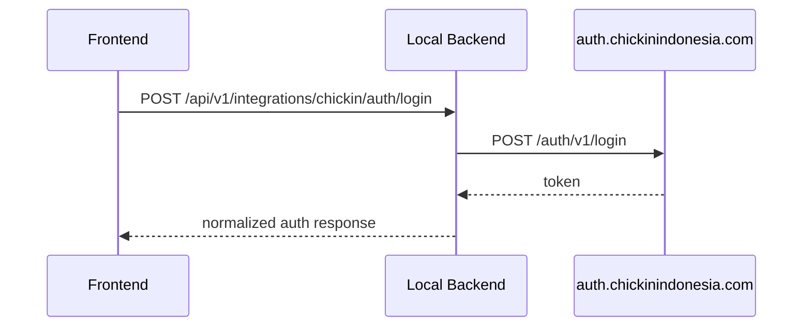
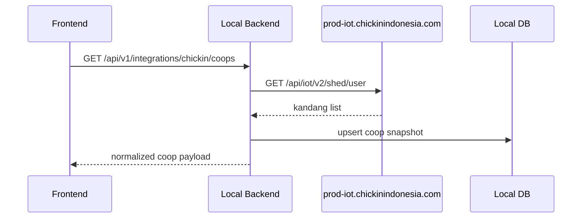
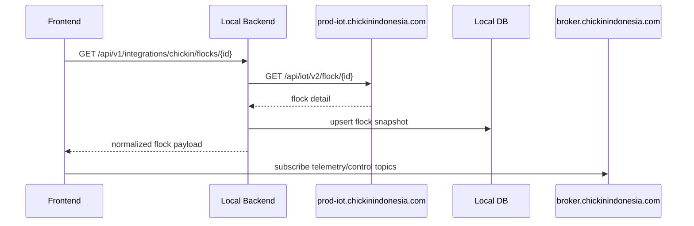

# Chickin Integration Design

Dokumen ini mendesain bagaimana endpoint Chickin yang sudah valid dipakai sebagai bagian dari arsitektur sistem, tanpa langsung mencampur antara source of truth eksternal dan domain logic lokal.

## 1. Tujuan

Tujuan desain ini:

- menetapkan endpoint Chickin yang sudah valid sebagai kontrak eksternal resmi,
- menentukan boundary antara frontend, backend lokal, dan service Chickin,
- menyiapkan adapter endpoint di backend lokal agar frontend tidak terus bergantung langsung ke domain eksternal,
- menentukan data apa yang harus tetap external-only, cache-only, atau disimpan ke database lokal.

## 2. System Boundary

### Chickin sebagai external system of record

Endpoint Chickin diperlakukan sebagai source of truth untuk:

- authentication user,
- list kandang milik user,
- detail flock/device operasional,
- feature capability device,
- log activity operasional,
- command pairing/unpairing yang masih native ke platform Chickin.

### Backend lokal sebagai orchestration layer

Backend lokal seharusnya menangani:

- adapter/proxy ke endpoint eksternal,
- persistence lokal untuk data yang dibutuhkan UI analitik,
- enrichment data farm yang tidak tersedia penuh di Chickin,
- konsolidasi endpoint supaya frontend hanya punya satu contract,
- analytics, AI, cache, sync state, dan aggregation.

## 3. Valid External Endpoint Inventory

Endpoint berikut dipakai sebagai input desain karena sudah dipakai/diakui valid dalam repo saat ini.

### 3.1 Auth Service

Base URL:

```text
https://auth.chickinindonesia.com
```

| Method | Path | Purpose | Consumer Saat Ini |
|---|---|---|---|
| `POST` | `/auth/v1/login` | login user | `frontend/lib/auth.ts` |
| `POST` | `/auth/v1/logout` | logout user | `frontend/lib/auth.ts` |
| `PUT` | `/api/users/me` | ambil profil user | `frontend/lib/auth.ts` |

Design note:

- Auth eksternal tetap boleh menjadi source of truth.
- Frontend idealnya tidak memanggil langsung endpoint ini; backend lokal perlu adapter auth sendiri.

### 3.2 IoT Service

Base URL:

```text
https://prod-iot.chickinindonesia.com
```

| Method | Path | Purpose | Consumer Saat Ini |
|---|---|---|---|
| `GET` | `/api/iot/v2/shed/user` | list kandang user | `frontend/lib/iot-api.ts` |
| `GET` | `/api/iot/v2/flock/{flockId}` | detail flock | `frontend/lib/iot-api.ts` |
| `GET` | `/api/iot/v3/feature?flockId={flockId}` | capability device | `frontend/lib/iot-api.ts` |
| `GET` | `/api/iot/flock/summary/{flockId}` | summary lingkungan | `frontend/lib/iot-api.ts` |
| `GET` | `/api/v2/log/chart/custom/flock/{flockId}` | chart custom | `frontend/lib/iot-api.ts` |
| `GET` | `/api/iot/v2/log-activity/flock/{flockId}` | log aktivitas | `frontend/lib/iot-api.ts` |
| `POST` | `/api/iot/v2/shed` | create kandang | `frontend/lib/iot-api.ts` |
| `DELETE` | `/api/iot/v2/shed/{idKandang}` | delete kandang | `frontend/lib/iot-api.ts` |
| `POST` | `/api/iot/v3/flock` | pairing flock/device | `frontend/lib/iot-api.ts` |
| `DELETE` | `/api/iot/flock/{flockId}` | unpair flock/device | `frontend/lib/iot-api.ts` |

Design note:

- Semua endpoint di atas harus dipetakan ke backend adapter lokal.
- Frontend tidak boleh lagi memegang `IOT_BASE_URL` sendiri setelah migrasi.

### 3.3 MQTT Broker

Broker:

```text
broker.chickinindonesia.com
```

Used channels:

- browser MQTT via `frontend/lib/mqtt.ts`
- optional backend MQTT when telemetry/command sink dibutuhkan

Design note:

- MQTT bukan REST endpoint, tetapi tetap bagian dari external integration contract.
- Kontrak topic dan credentials perlu didaftarkan dalam integration registry, bukan di-hardcode tersebar.

## 4. Target Backend Adapter API

Frontend target seharusnya berbicara hanya dengan backend lokal. Untuk itu backend lokal perlu menyediakan adapter endpoint seperti berikut.

### 4.1 Auth Adapter

| Method | Local Path | Upstream |
|---|---|---|
| `POST` | `/api/v1/integrations/chickin/auth/login` | `POST /auth/v1/login` |
| `POST` | `/api/v1/integrations/chickin/auth/logout` | `POST /auth/v1/logout` |
| `GET` | `/api/v1/integrations/chickin/auth/me` | `PUT /api/users/me` |

### 4.2 Coop and Flock Adapter

| Method | Local Path | Upstream |
|---|---|---|
| `GET` | `/api/v1/integrations/chickin/coops` | `GET /api/iot/v2/shed/user` |
| `POST` | `/api/v1/integrations/chickin/coops` | `POST /api/iot/v2/shed` |
| `DELETE` | `/api/v1/integrations/chickin/coops/{coop_id}` | `DELETE /api/iot/v2/shed/{idKandang}` |
| `GET` | `/api/v1/integrations/chickin/flocks/{flock_id}` | `GET /api/iot/v2/flock/{flockId}` |
| `POST` | `/api/v1/integrations/chickin/flocks` | `POST /api/iot/v3/flock` |
| `DELETE` | `/api/v1/integrations/chickin/flocks/{flock_id}` | `DELETE /api/iot/flock/{flockId}` |
| `GET` | `/api/v1/integrations/chickin/flocks/{flock_id}/features` | `GET /api/iot/v3/feature?flockId=...` |
| `GET` | `/api/v1/integrations/chickin/flocks/{flock_id}/summary` | `GET /api/iot/flock/summary/{flockId}` |
| `GET` | `/api/v1/integrations/chickin/flocks/{flock_id}/chart` | `GET /api/v2/log/chart/custom/flock/{flockId}` |
| `GET` | `/api/v1/integrations/chickin/flocks/{flock_id}/activity-log` | `GET /api/iot/v2/log-activity/flock/{flockId}` |

### 4.3 Integration Registry

Registry internal untuk konfigurasi upstream:

| Method | Local Path | Purpose |
|---|---|---|
| `GET` | `/api/v1/integrations/external-endpoints` | list endpoint registry |
| `POST` | `/api/v1/integrations/external-endpoints` | register endpoint/config |
| `PATCH` | `/api/v1/integrations/external-endpoints/{id}` | update registry |
| `DELETE` | `/api/v1/integrations/external-endpoints/{id}` | hapus registry |

## 5. Data Ownership Design

Tidak semua data perlu disimpan permanen ke database lokal.

### Keep external-only

- login credential exchange,
- raw logout flow,
- pairing/unpairing command yang masih menjadi domain platform Chickin.

### Cache or snapshot locally

- daftar kandang per user,
- detail flock terkini,
- feature set per flock,
- summary lingkungan terbaru,
- activity log terbatas untuk kebutuhan UI dan audit singkat.

### Persist as local domain data

- enrichment metadata kandang internal,
- daily production metrics,
- maintenance logs,
- AI/analytics derived metrics,
- external endpoint registry,
- sync status dan last successful refresh.

## 6. Target Local Data Model

Minimal tabel/domain yang dibutuhkan di backend lokal:

- `coops`
- `flocks`
- `daily_metrics`
- `maintenance_logs`
- `external_endpoints`
- `telemetry`
- `alarms`
- `commands`

Catatan:

- `coops` dan `flocks` menyimpan snapshot domain farm yang bisa diambil dari Chickin lalu diperkaya lokal.
- `daily_metrics` dan `maintenance_logs` adalah local-first karena saat ini frontend membutuhkannya tetapi belum ada source lokal yang konsisten.

## 7. Sequence Design

### Login Flow



### Kandang List Flow



### Flock Detail Flow



## 8. Migration Strategy

### Phase 1

- dokumentasikan semua endpoint Chickin valid,
- tambahkan integration registry,
- tambahkan adapter endpoint lokal tanpa mengubah frontend penuh.

### Phase 2

- pindahkan frontend auth dan iot calls ke backend adapter,
- normalisasi response shape supaya frontend tidak tergantung format upstream mentah,
- simpan snapshot `coops` dan `flocks` ke DB lokal.

### Phase 3

- bangun local-first fitur yang belum ada di upstream:
  - daily metrics,
  - maintenance logs,
  - performance index,
  - AI analytics cache.

### Phase 4

- audit route frontend yang masih dummy,
- ganti dummy cards/map/performance dengan API lokal yang sudah distabilkan,
- kurangi hardcoded endpoint di frontend menjadi nol.

## 9. Decision Summary

- Endpoint Chickin yang valid tetap dipakai, tetapi harus berada di belakang backend adapter lokal.
- Database lokal tidak menggantikan Chickin untuk auth dan operasional inti, melainkan menyimpan snapshot dan enrichment data farm.
- Frontend target hanya mengetahui backend lokal dan broker MQTT yang sudah didaftarkan, bukan base URL eksternal secara langsung.

## 10. Realization Status (Sprint 1 — 2026-03-18)

### Adapter endpoint yang sudah ada

| Local Path | Upstream | Status |
|---|---|---|
| `POST /api/v1/integrations/chickin/auth/login` | `POST /auth/v1/login` | done |
| `POST /api/v1/integrations/chickin/auth/logout` | `POST /auth/v1/logout` | done |
| `GET /api/v1/integrations/chickin/auth/me` | `PUT /api/users/me` | done |
| `GET /api/v1/integrations/chickin/coops` | `GET /api/iot/v2/shed/user` | done (+ snapshot upsert) |
| `GET /api/v1/integrations/chickin/flocks/{id}` | `GET /api/iot/v2/flock/{id}` | done (+ snapshot upsert) |

### Adapter endpoint yang belum ada

| Local Path | Upstream | Status |
|---|---|---|
| `GET .../flocks/{id}/features` | `GET /api/iot/v3/feature` | todo |
| `GET .../flocks/{id}/summary` | `GET /api/iot/flock/summary/{id}` | todo |
| `GET .../flocks/{id}/chart` | `GET /api/v2/log/chart/custom/flock/{id}` | todo |
| `GET .../flocks/{id}/activity-log` | `GET /api/iot/v2/log-activity/flock/{id}` | todo |
| `POST .../coops` | `POST /api/iot/v2/shed` | todo |
| `DELETE .../coops/{id}` | `DELETE /api/iot/v2/shed/{id}` | todo |
| `POST .../flocks` | `POST /api/iot/v3/flock` | todo |
| `DELETE .../flocks/{id}` | `DELETE /api/iot/flock/{id}` | todo |

### Key implementation files

- `backend/app/services/chickin_client.py` — HTTP client, normalization, error mapping
- `backend/app/api/chickin_adapter.py` — FastAPI adapter endpoints
- `backend/app/core/config.py` — `chickin_auth_base_url`, `chickin_iot_base_url`
